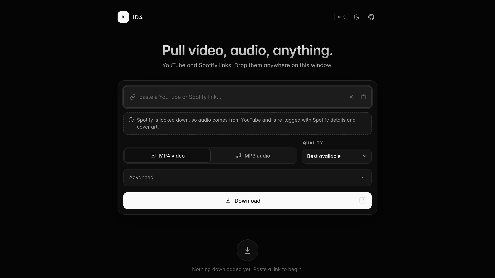

# ID4

A small YouTube downloader with a clean monochrome interface. Paste a link, pick MP4 or MP3, hit download.



Everything it needs lives inside its own folder. Delete the folder and nothing is left behind on your machine.

## Getting started

On macOS or Linux:

```bash
./setup.sh     # run once, sets everything up
./start.sh     # opens the app in your browser
```

The first run installs what it needs. After that, `./start.sh` is all you need.

On Windows, run the same steps by hand:

```
python -m venv .venv
.venv\Scripts\pip install -r requirements.txt
.venv\Scripts\python setup_ffmpeg.py
.venv\Scripts\python app.py
```

## Settings

| Setting | What it does |
|---|---|
| **MP4 or MP3** | A video file, or audio only. |
| **Quality** | For MP4, the biggest size to allow. For MP3, the bitrate. |
| **Embed thumbnail** | Saves the cover image into the file so players show artwork. |
| **Embed metadata** | Writes the title, channel and date into the file. On by default. |
| **Embed subtitles** | For MP4, pulls English subtitles in as a subtitle track. |

Spotify track links also work. Spotify itself is locked down, so the audio comes from YouTube and gets labelled with the Spotify title, artist, album and cover art.

## Options

You can change these when you launch it:

```bash
ID4_PORT=8080 ./start.sh     # use a different port
ID4_NO_BROWSER=1 ./start.sh  # do not open a browser
```

## If a download stops working

YouTube changes things often. Updating usually fixes it:

```bash
.venv/bin/pip install --upgrade yt-dlp
```

## Removing it

Delete the folder. Nothing is installed anywhere else on your system.

## A note

For personal use, with things you have the right to download. Please respect the people who made them.
